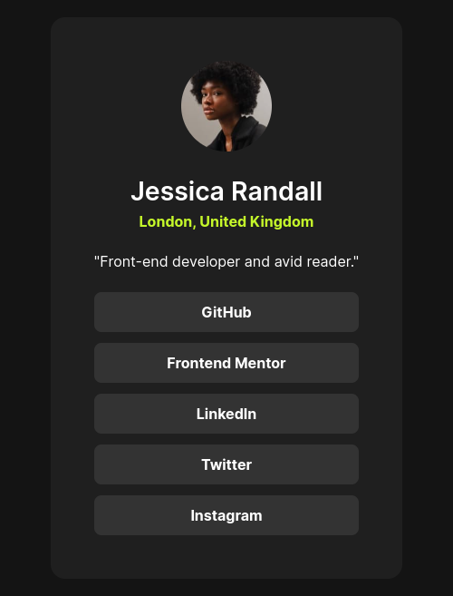

# Social Profile Links - Frontend Mentor project

This is a solution to the [Social Profile Links](https://www.frontendmentor.io/challenges/social-links-profile-UG32l9m6dQ).

- [Social Profile Links - Frontend Mentor project](#social-profile-links---frontend-mentor-project)
  - [Tools used](#tools-used)
  - [Preview](#preview)
    - [Desktop Preview](#desktop-preview)
    - [Mobile preview](#mobile-preview)
  - [Links](#links)

## Tools used

- [Visual Studio Code](https://www.code.visualstudio.com)
- HTML and CSS
- CSS Flexbox
- CSS Variables

## Preview

### Desktop Preview

### Mobile preview

## Links

- Repository URL - [github.com/Code-Beaker/social-links-profile](https://github.com/Code-Beaker/social-links-profile)
- Netlify URL - [social-links-profile.netlify.app](https://fmentor-social-links-card.netlify.app/)
